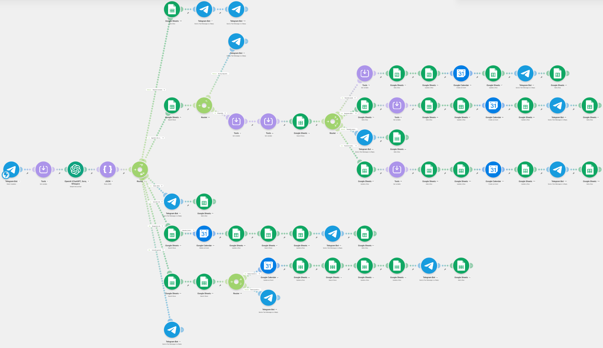
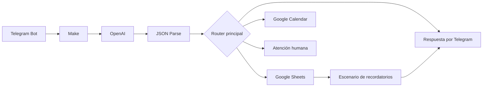
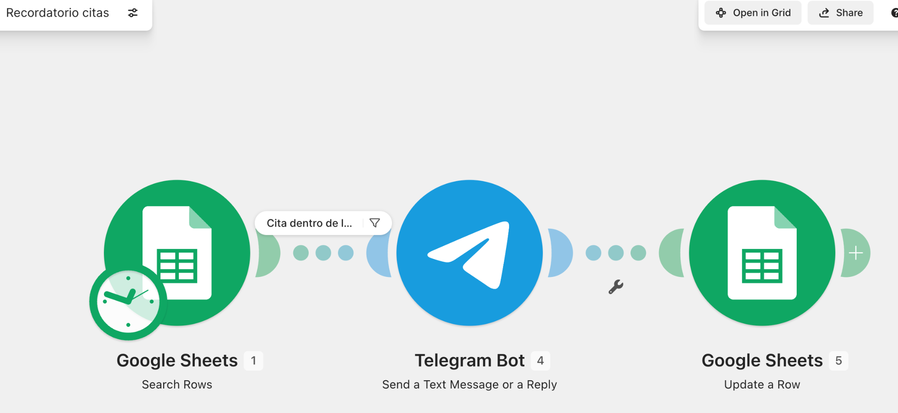

# MediCitas IA — Gestión inteligente de citas médicas

MediCitas IA es un asistente automatizado para gestionar citas médicas mediante conversaciones en Telegram. El sistema interpreta mensajes en lenguaje natural, clasifica la intención del usuario y coordina Make, OpenAI, Google Sheets y Google Calendar para ejecutar tareas administrativas.

> **Aviso:** este proyecto es una demostración académica. No realiza diagnósticos, no recomienda medicamentos y no sustituye la atención médica profesional.



## Demostración pública

[Ver el escenario público en Make](https://us2.make.com/public/shared-scenario/fYTnGTGaoIk/medi-citas-ia-gestion-de-citas-medicas)

El escenario compartido permite visualizar la arquitectura. Para ejecutarlo en otra cuenta es necesario configurar conexiones propias y reemplazar los identificadores de demostración.

## Funcionalidades

- Agendar citas después de validar paciente, especialidad, fecha, hora y disponibilidad.
- Cancelar citas y liberar nuevamente el horario.
- Reagendar citas sin perder la sincronización con Google Calendar.
- Consultar horarios, ubicación y costo de consulta.
- Registrar pacientes nuevos y reutilizar pacientes existentes.
- Mantener una bitácora de solicitudes y resultados.
- Canalizar urgencias o casos delicados a atención humana.
- Enviar recordatorios automáticos por Telegram antes de la cita.

## Arquitectura



### Flujo principal

1. Telegram recibe el mensaje del usuario.
2. OpenAI extrae la intención y los datos en JSON.
3. Make valida campos y dirige la solicitud a la ruta adecuada.
4. Google Sheets funciona como base de datos de pacientes, citas, disponibilidad y bitácora.
5. Google Calendar crea, actualiza o elimina el evento correspondiente.
6. Telegram devuelve la confirmación o canaliza el caso a una persona.

## Tecnologías

- Make
- OpenAI
- Telegram Bot
- Google Sheets
- Google Calendar
- JSON estructurado
- Automatización visual y procesamiento de lenguaje natural

## Estructura del repositorio

```text
medicitas-ia/
├── assets/
│   ├── flujo-principal-make.png
│   └── recordatorio-citas-make.png
├── blueprints/
│   ├── medicitas-ia-sanitizado.blueprint.json
│   └── recordatorio-citas-sanitizado.blueprint.json
├── data/
│   └── base-datos-demo.xlsx
├── docs/
│   ├── casos-de-prueba.md
│   ├── configuracion.md
│   ├── documentacion-tecnica.md
│   └── prompt-openai.md
├── .gitignore
├── DISCLAIMER.md
├── GITHUB.md
├── SECURITY.md
└── README.md
```

## Puesta en marcha

Consulta [docs/configuracion.md](docs/configuracion.md). Los blueprints fueron sanitizados: no contienen credenciales, conexiones activas, identificadores privados ni datos reales de pacientes.

## Base de datos

La plantilla de demostración incluye cuatro hojas compatibles con el flujo:

- **Citas:** citas registradas y referencia del evento de Calendar.
- **Disponibilidad:** horarios, doctores, especialidades y estado del espacio.
- **Pacientes:** registro básico asociado al usuario de Telegram.
- **Bitacora:** historial de solicitudes, respuestas y resultados.

Todos los datos de `data/base-datos-demo.xlsx` son ficticios.

## Recordatorios



El segundo escenario consulta citas confirmadas o reagendadas, envía el recordatorio por Telegram y actualiza el estado del recordatorio en Google Sheets.

## Pruebas

Los casos recomendados se encuentran en [docs/casos-de-prueba.md](docs/casos-de-prueba.md) e incluyen:

- paciente nuevo con datos completos;
- paciente sin información suficiente;
- horario ocupado;
- cancelación;
- reagendado disponible y no disponible;
- consultas administrativas;
- detección de urgencia y escalamiento humano.

## Aprendizajes demostrados

- Diseño de flujos complejos con routers y filtros.
- Integración de servicios mediante automatización no-code.
- Extracción estructurada de datos con IA.
- Sincronización entre una base tabular y un calendario.
- Validación de reglas de negocio y manejo de excepciones.
- Diseño responsable de un asistente en un contexto sensible.

## Autores

Proyecto académico desarrollado por:

- José Pablo Vaquero Malvaez
- Elizabeth Ameyally Pacindo Santillan
