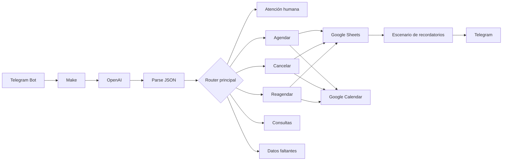

# MediCitas IA — Gestión inteligente de citas médicas

MediCitas IA es una automatización administrativa que permite gestionar citas médicas mediante conversaciones en Telegram. El sistema interpreta mensajes en lenguaje natural, extrae información estructurada con OpenAI y coordina Make, Google Sheets y Google Calendar para ejecutar cada operación.

> **Aviso:** este proyecto es una demostración académica. No realiza diagnósticos, no recomienda medicamentos y no sustituye la atención médica profesional.


## Demostración pública

[Ver el escenario público en Make](https://us2.make.com/public/shared-scenario/fYTnGTGaoIk/medi-citas-ia-gestion-de-citas-medicas)

El escenario compartido permite revisar visualmente la arquitectura. Para ejecutarlo en otra cuenta es necesario importar el blueprint sanitizado, crear conexiones propias y configurar los identificadores indicados en la documentación.

## Funcionalidades

- Agendar citas después de validar paciente, fecha, hora, especialidad y disponibilidad.
- Registrar pacientes nuevos con teléfono, correo y fecha de nacimiento.
- Reutilizar pacientes existentes sin duplicar registros.
- Completar automáticamente registros de pacientes incompletos.
- Rechazar horarios ocupados sin modificar la base de datos.
- Cancelar citas y liberar nuevamente el horario.
- Cancelar citas aunque no exista un `Calendar_Event_ID`.
- Reagendar citas conservando el mismo `ID_Cita`.
- Crear un nuevo evento cuando una cita no tiene evento previo en Calendar.
- Consultar horarios, ubicación y costo de consulta.
- Mantener una bitácora de solicitudes y resultados.
- Canalizar urgencias o solicitudes especiales a atención humana.
- Enviar recordatorios automáticos por Telegram antes de la cita.

## Arquitectura



### Flujo principal

1. Telegram recibe el mensaje del usuario.
2. OpenAI clasifica la intención y devuelve una estructura JSON.
3. `Parse JSON` convierte la respuesta en campos utilizables por Make.
4. El router principal dirige la solicitud a la ruta correspondiente.
5. Google Sheets valida y almacena pacientes, citas y disponibilidad.
6. Google Calendar crea, actualiza o elimina el evento.
7. Telegram devuelve la respuesta administrativa.
8. La operación se registra en la bitácora.

## Intenciones admitidas

```text
agendar_cita
reagendar_cita
cancelar_cita
consultar_horarios
consultar_costo
consultar_ubicacion
urgencia
humano
otra
```

## Tecnologías

- Make
- OpenAI
- Telegram Bot
- Google Sheets
- Google Calendar
- JSON estructurado
- Automatización no-code
- Procesamiento de lenguaje natural

## Estructura del repositorio

```text
medicitas-ia/
├── assets/
│   ├── flujo-principal-make.png
│   └── recordatorio-citas-make.png
├── blueprints/
│   ├── medicitas-ia-sanitizado.blueprint.json
│   └── recordatorio-citas-sanitizado.blueprint.json
├── data/
│   └── base-datos-demo.xlsx
├── docs/
│   ├── casos-de-prueba.md
│   ├── configuracion.md
│   ├── documentacion-tecnica.md
│   └── prompt-openai.md
├── .gitignore
├── DISCLAIMER.md
├── GITHUB.md
├── SECURITY.md
└── README.md
```

## Puesta en marcha

Consulta la guía completa:

[Configuración del proyecto](docs/configuracion.md)

Resumen:

1. Importa los dos blueprints en Make.
2. Sube `data/base-datos-demo.xlsx` a Google Drive.
3. Configura las conexiones de Telegram, OpenAI y Google.
4. Selecciona tu archivo de Google Sheets.
5. Selecciona un calendario de demostración.
6. Configura el grupo interno de Telegram.
7. Activa el procesamiento secuencial.
8. Ejecuta los casos de prueba.

## Marcadores de configuración

Los blueprints públicos utilizan estos valores:

```text
CONFIGURAR_SPREADSHEET_ID
CONFIGURAR_CALENDAR_ID
CONFIGURAR_CHAT_ID_EQUIPO
```

Las conexiones y webhooks aparecen con valor `0` y deben configurarse después de importar:

```json
"__IMTCONN__": 0
```

```json
"__IMTHOOK__": 0
```

## Base de datos

La plantilla incluye cuatro hojas:

### `Citas`

Almacena:

- identificador de la cita;
- fecha y hora;
- paciente;
- doctor;
- especialidad;
- estado;
- evento de Calendar;
- Chat ID;
- estado del recordatorio.

### `Disponibilidad`

Controla los espacios disponibles por fecha, hora, doctor y especialidad.

```text
Horario libre:
Disponible = Sí
ID_Cita = vacío
```

```text
Horario ocupado:
Disponible = No
ID_Cita = CITA-...
```

### `Pacientes`

Almacena datos administrativos básicos y la relación con Telegram.

### `Bitacora`

Registra:

- fecha y hora;
- usuario;
- mensaje original;
- respuesta;
- acción;
- resultado.

La plantilla pública está limpia y contiene únicamente información ficticia.

## Reglas de formato

Las búsquedas dependen de formatos consistentes:

```text
Fecha: YYYY-MM-DD
Hora: HH:mm
```

Ejemplos:

```text
2026-07-13
09:00
10:30
```

## Validaciones importantes

El escenario utiliza variables de control para evitar falsos positivos cuando una búsqueda devuelve cero filas:

```text
horario_agendar_encontrado
paciente_encontrado
cita_cancelar_encontrada
cita_reagendar_encontrada
horario_reagendar_encontrado
```

Cada variable comienza con `no` y solo cambia a `si` cuando Make encuentra una fila válida.

También se utiliza procesamiento secuencial para reducir el riesgo de que dos ejecuciones ocupen el mismo horario.

## Recordatorios


El segundo escenario:

1. Busca citas `Confirmada` o `Reagendada`.
2. Comprueba que `Recordatorio_30min` sea `Pendiente`.
3. Verifica que la cita se encuentre dentro de la ventana configurada.
4. Envía el recordatorio por Telegram.
5. Cambia el estado a `Enviado`.

## Pruebas

El proyecto incluye una batería de 30 casos:

[Ver casos de prueba](docs/casos-de-prueba.md)

Las pruebas cubren:

- consultas administrativas;
- datos faltantes;
- urgencias y atención humana;
- paciente nuevo completo e incompleto;
- paciente existente;
- horario ocupado;
- cancelación con y sin evento de Calendar;
- cita inexistente;
- reagendado disponible y no disponible;
- reagendado sin evento;
- prevención de pacientes duplicados;
- procesamiento secuencial;
- recordatorios.

## Documentación

- [Guía de configuración](docs/configuracion.md)
- [Documentación técnica](docs/documentacion-tecnica.md)
- [Casos de prueba](docs/casos-de-prueba.md)
- [Prompt de OpenAI](docs/prompt-openai.md)
- [Política de seguridad](SECURITY.md)
- [Aviso y limitaciones](DISCLAIMER.md)

## Seguridad

Los blueprints públicos no deben contener:

- tokens de Telegram;
- API keys;
- credenciales OAuth;
- correos personales;
- IDs reales de Google Sheets;
- IDs reales de Google Calendar;
- Chat IDs privados;
- datos reales de pacientes.

Antes de publicar una nueva versión del escenario, exporta una copia y sanitízala.

## Alcance

Este proyecto demuestra:

- diseño de flujos complejos con routers y filtros;
- integración entre varios servicios;
- extracción estructurada de datos mediante IA;
- manejo de estados y reglas de negocio;
- sincronización entre una base tabular y un calendario;
- automatización responsable en un contexto sensible;
- documentación y pruebas de un sistema no-code.

No incluye:

- expediente médico electrónico;
- diagnóstico;
- tratamiento;
- autenticación clínica;
- cumplimiento normativo certificado;
- garantías de disponibilidad para producción.

## Autores

Proyecto académico desarrollado por:

- José Pablo Vaquero Malvaez
- Elizabeth Ameyally Pacindo Santillan
