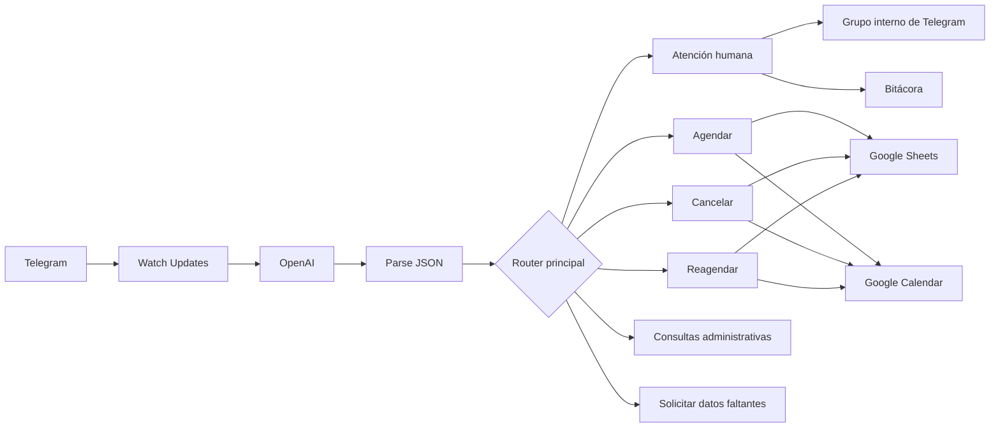

# Documentación técnica — MediCitas IA

## 1. Descripción general

MediCitas IA es una automatización administrativa para gestionar citas médicas mediante Telegram. El escenario principal recibe mensajes en lenguaje natural, utiliza OpenAI para convertirlos en una estructura JSON y dirige cada solicitud mediante routers y filtros de Make.

El sistema puede:

- agendar citas;
- cancelar citas;
- reagendar citas;
- consultar horarios, ubicación y costo;
- registrar y reutilizar pacientes;
- sincronizar citas con Google Calendar;
- mantener una bitácora;
- canalizar urgencias o solicitudes de atención humana.

> **Aviso:** este proyecto es una demostración académica. No realiza diagnósticos, no recomienda medicamentos y no sustituye la atención médica profesional.

## 2. Tecnologías utilizadas

| Tecnología | Función |
|---|---|
| Telegram Bot | Canal de comunicación con el usuario |
| Make | Orquestación de la automatización |
| OpenAI | Clasificación de intención y extracción estructurada |
| Google Sheets | Base de datos de pacientes, citas, disponibilidad y bitácora |
| Google Calendar | Creación, actualización y eliminación de eventos |
| JSON | Contrato de datos entre OpenAI y Make |

## 3. Arquitectura general



## 4. Configuración del escenario

El escenario principal utiliza procesamiento secuencial para reducir el riesgo de que dos ejecuciones intenten ocupar el mismo horario al mismo tiempo.

Configuración relevante:

| Propiedad | Valor |
|---|---|
| Procesamiento en orden | Activado |
| Procesamiento instantáneo | Activado |
| Zona de Make | `us2.make.com` |
| Errores máximos configurados | 3 |
| Confirmación automática | Activada |

La zona horaria recomendada para el escenario, Google Sheets y Google Calendar es:

```text
America/Mexico_City
```

## 5. Entrada del escenario

El escenario inicia con el módulo de Telegram `Watch Updates`.

Dato principal recibido:

```text
{{1.message.text}}
```

También se utilizan datos del mensaje para asociar operaciones con el usuario:

```text
{{1.message.chat.id}}
{{1.message.from.username}}
```

El `chat.id` recibido dinámicamente no es una credencial. Se usa para responder al mismo usuario y relacionar sus registros.

## 6. Procesamiento con OpenAI

El módulo de OpenAI recibe el mensaje y devuelve únicamente JSON válido.

Intenciones admitidas:

- `agendar_cita`
- `reagendar_cita`
- `cancelar_cita`
- `consultar_horarios`
- `consultar_costo`
- `consultar_ubicacion`
- `urgencia`
- `humano`
- `otra`

Estructura esperada:

```json
{
  "intencion": "",
  "nombre": "",
  "telefono": "",
  "correo": "",
  "fecha_nacimiento": "",
  "fecha_solicitada": "",
  "hora_solicitada": "",
  "fecha_original": "",
  "hora_original": "",
  "nueva_fecha": "",
  "nueva_hora": "",
  "especialidad": "",
  "motivo": "",
  "datos_faltantes": [],
  "requiere_humano": "",
  "prioridad": "",
  "respuesta_usuario": ""
}
```

Reglas de normalización principales:

- fechas de cita en `YYYY-MM-DD`;
- horas en `HH:mm`;
- fecha de nacimiento en `YYYY-MM-DD`;
- nombres con formato normal;
- especialidades limitadas a los valores configurados;
- `requiere_humano` solamente puede ser `si` o `no`;
- `prioridad` solamente puede ser `baja`, `media` o `alta`.

El prompt completo se documenta en:

```text
docs/prompt-openai.md
```

## 7. Parseo del JSON

El módulo `Parse JSON` transforma la respuesta textual del modelo en campos que Make puede utilizar dentro de filtros, búsquedas y actualizaciones.

El flujo principal es:

```text
Telegram → OpenAI → Parse JSON → Router principal
```

Una respuesta que no sea JSON válido detendría el procesamiento antes de llegar al router. Por esta razón, el prompt obliga al modelo a no agregar Markdown, comentarios ni explicaciones fuera del objeto JSON.

## 8. Router principal

El router principal distribuye la ejecución entre las siguientes rutas:

| Ruta | Condición general | Resultado |
|---|---|---|
| Atención humana | Urgencia, caso delicado o solicitud de una persona | Respuesta segura, alerta interna y bitácora |
| Agendar cita | Datos mínimos completos | Verificación de disponibilidad y paciente |
| Agendar con datos faltantes | Falta algún dato de la cita | Solicitud de información pendiente |
| Cancelar cita | Nombre, fecha y hora completos | Búsqueda y cancelación |
| Reagendar cita | Cita original y nuevo horario completos | Búsqueda y actualización |
| Consulta general | Horarios, ubicación, costo u otra consulta administrativa | Respuesta directa |
| Cancelación incompleta | Faltan datos para localizar la cita | Solicitud de nombre, fecha u hora |
| Reagendado incompleto | Faltan datos actuales o nuevos | Solicitud de información pendiente |

## 9. Ruta de atención humana

Se activa cuando:

```text
requiere_humano = si
```

o cuando la intención es:

```text
urgencia
humano
```

Acciones:

1. Envía al usuario una respuesta segura.
2. Envía una alerta al grupo interno de Telegram.
3. Registra el caso en `Bitacora`.
4. Conserva la prioridad asignada por OpenAI.

Para urgencias:

```text
requiere_humano = si
prioridad = alta
```

Para solicitudes explícitas de una persona sin urgencia:

```text
requiere_humano = si
prioridad = media
```

El bot no diagnostica ni proporciona indicaciones médicas.

## 10. Ruta para agendar una cita

### 10.1 Datos mínimos

Para iniciar el agendado se necesitan:

- nombre;
- fecha solicitada;
- hora solicitada;
- especialidad;
- motivo breve.

Los datos de registro del paciente —teléfono, correo y fecha de nacimiento— se validan después de comprobar que existe disponibilidad.

### 10.2 Búsqueda de disponibilidad

Antes de la búsqueda se inicializa:

```text
horario_agendar_encontrado = no
```

La hoja `Disponibilidad` se consulta utilizando:

```text
Fecha = fecha_solicitada
Hora = hora_solicitada
Especialidad = especialidad
Disponible = Sí
```

La variable solamente cambia a:

```text
horario_agendar_encontrado = si
```

cuando la búsqueda devuelve una fila real y su columna `Disponible` contiene `Sí`.

Si no se encuentra una fila, el bot informa que el horario no está disponible y no crea ningún paciente, cita o evento.

### 10.3 Generación de identificadores

La cita recibe un identificador interno con formato:

```text
CITA-YYYYMMDDHHmmss
```

Para un paciente nuevo se genera:

```text
PAC-CHAT_ID-YYYYMMDDHHmmss
```

Estos identificadores permiten relacionar las hojas `Citas`, `Pacientes` y `Disponibilidad`.

### 10.4 Búsqueda del paciente

Antes de buscar se inicializa:

```text
paciente_encontrado = no
```

La búsqueda utiliza:

```text
Chat_ID = chat.id de Telegram
Nombre = nombre normalizado
```

La variable solamente cambia a `si` cuando la búsqueda devuelve un `ID_Paciente` real y no vacío.

### 10.5 Casos de paciente

#### Paciente existente y completo

Se considera completo cuando ya tiene:

- teléfono;
- correo;
- fecha de nacimiento.

Acciones:

1. Reutiliza el `ID_Paciente`.
2. Crea la fila en `Citas`.
3. Marca el horario como ocupado.
4. Crea el evento en Calendar.
5. Guarda `Calendar_Event_ID`.
6. Responde al usuario.
7. Registra el resultado en `Bitacora`.

#### Paciente existente e incompleto con datos nuevos

Se activa cuando el paciente existe, tiene al menos un dato faltante y el mensaje incluye teléfono, correo y fecha de nacimiento.

Acciones:

1. Actualiza la misma fila de `Pacientes`.
2. Conserva el `ID_Paciente`.
3. Crea la cita.
4. Ocupa el horario.
5. Crea el evento.
6. Guarda el ID de Calendar.
7. Confirma por Telegram.
8. Registra en bitácora.

#### Paciente existente e incompleto sin datos suficientes

No crea la cita. Solicita:

- teléfono;
- correo;
- fecha de nacimiento;
- datos de la cita en un solo mensaje.

El horario permanece disponible.

#### Paciente nuevo con datos completos

Acciones:

1. Registra el paciente.
2. Guarda el nuevo `ID_Paciente`.
3. Crea la cita.
4. Ocupa el horario.
5. Crea el evento.
6. Guarda `Calendar_Event_ID`.
7. Confirma por Telegram.
8. Registra en bitácora.

#### Paciente nuevo sin datos completos

No registra todavía al paciente ni crea la cita. Solicita teléfono, correo y fecha de nacimiento. El horario continúa libre.

## 11. Consistencia al confirmar una cita

Una cita confirmada debe producir simultáneamente estos estados:

### Hoja `Citas`

```text
Estado = Confirmada
Calendar_Event_ID = valor del evento creado
Recordatorio_30min = Pendiente
```

### Hoja `Disponibilidad`

```text
Disponible = No
ID_Cita = mismo ID de la hoja Citas
```

### Google Calendar

Debe existir un evento con:

- nombre del paciente;
- fecha y hora;
- especialidad;
- doctor;
- motivo;
- ID interno de la cita.

## 12. Ruta para cancelar una cita

### 12.1 Datos requeridos

- nombre;
- fecha de la cita;
- hora de la cita.

Antes de buscar se inicializa:

```text
cita_cancelar_encontrada = no
```

La búsqueda utiliza:

- nombre;
- fecha;
- hora;
- `Chat_ID`;
- estado `Confirmada` o `Reagendada`.

La variable cambia a `si` solamente cuando se encuentra una fila con `ID_Cita` válido.

### 12.2 Cita no encontrada

Cuando la búsqueda no devuelve una fila:

- responde que no encontró una cita activa;
- no modifica Calendar;
- no cambia `Citas`;
- no cambia `Disponibilidad`.

### 12.3 Cancelación con `Calendar_Event_ID`

Acciones:

1. Elimina el evento de Google Calendar.
2. Cambia `Estado` a `Cancelada`.
3. Busca en `Disponibilidad` por `ID_Cita`.
4. Cambia `Disponible` a `Sí`.
5. Limpia `ID_Cita`.
6. Confirma por Telegram.
7. Registra la cancelación.

### 12.4 Cancelación sin `Calendar_Event_ID`

Cuando el campo está vacío, la automatización continúa sin intentar eliminar un evento inexistente:

1. Cambia la cita a `Cancelada`.
2. Localiza y libera el horario.
3. Confirma por Telegram.
4. Registra la cancelación.

## 13. Ruta para reagendar una cita

### 13.1 Datos requeridos

- nombre;
- fecha original;
- hora original;
- nueva fecha;
- nueva hora.

Antes de buscar se inicializa:

```text
cita_reagendar_encontrada = no
```

La cita original se busca mediante:

- nombre;
- fecha original;
- hora original;
- `Chat_ID`;
- estado `Confirmada` o `Reagendada`.

### 13.2 Cita original no encontrada

No modifica ningún dato y responde que no encontró la cita activa.

### 13.3 Comprobación del nuevo horario

Antes de buscar se inicializa:

```text
horario_reagendar_encontrado = no
```

El nuevo horario se consulta por:

- nueva fecha;
- nueva hora;
- especialidad de la cita original;
- `Disponible = Sí`.

Si el nuevo horario está ocupado:

- conserva la cita original;
- conserva el evento original;
- no cambia ninguna disponibilidad;
- solicita otra fecha u hora.

### 13.4 Reagendado con `Calendar_Event_ID`

Acciones:

1. Actualiza el evento existente.
2. Actualiza fecha, hora y estado en `Citas`.
3. Libera el horario anterior.
4. Ocupa el nuevo horario.
5. Conserva el mismo `ID_Cita`.
6. Cambia el estado a `Reagendada`.
7. Confirma por Telegram.
8. Registra en bitácora.

### 13.5 Reagendado sin `Calendar_Event_ID`

Acciones:

1. Crea un nuevo evento en Calendar.
2. Guarda el nuevo `Calendar_Event_ID`.
3. Actualiza `Citas`.
4. Libera el horario anterior.
5. Ocupa el nuevo horario.
6. Conserva el mismo `ID_Cita`.
7. Cambia el estado a `Reagendada`.
8. Confirma por Telegram.
9. Registra en bitácora.

## 14. Consultas administrativas

Las consultas de horario, ubicación y costo se responden directamente con la información configurada en el prompt.

Estas rutas no deben:

- crear pacientes;
- crear citas;
- modificar disponibilidad;
- crear eventos de Calendar.

Información configurada para la demostración:

| Concepto | Valor |
|---|---|
| Horario entre semana | Lunes a viernes de 9:00 a 18:00 |
| Horario del sábado | 9:00 a 14:00 |
| Ubicación | Hospital Mac |
| Consulta general | $500 MXN |
| Especialidades | Medicina general, Pediatría, Cardiología y Dermatología |

## 15. Modelo de datos

### 15.1 Hoja `Citas`

| Campo | Descripción |
|---|---|
| `ID_Cita` | Identificador interno único |
| `Fecha` | Fecha en formato `YYYY-MM-DD` |
| `Hora` | Hora en formato `HH:mm` |
| `ID_Paciente` | Relación con `Pacientes` |
| `Paciente` | Nombre normalizado |
| `Doctor` | Profesional asignado |
| `Especialidad` | Área médica |
| `Estado` | `Confirmada`, `Reagendada` o `Cancelada` |
| `Canal` | Canal de origen |
| `Notas` | Motivo breve |
| `Calendar_Event_ID` | ID del evento de Calendar |
| `Chat_ID` | Chat de Telegram asociado |
| `Recordatorio_30min` | `Pendiente` o `Enviado` |

### 15.2 Hoja `Disponibilidad`

| Campo | Descripción |
|---|---|
| `Fecha` | Día disponible |
| `Hora` | Hora del espacio |
| `Doctor` | Profesional |
| `Especialidad` | Especialidad |
| `Disponible` | `Sí` o `No` |
| `ID_Cita` | Cita que ocupa el espacio |

Reglas:

```text
Horario libre:
Disponible = Sí
ID_Cita = vacío

Horario ocupado:
Disponible = No
ID_Cita = CITA-...
```

### 15.3 Hoja `Pacientes`

| Campo | Descripción |
|---|---|
| `ID_Paciente` | Identificador interno |
| `Nombre` | Nombre normalizado |
| `Telefono` | Teléfono proporcionado |
| `Correo` | Correo proporcionado |
| `Fecha_Nacimiento` | Fecha en `YYYY-MM-DD` |
| `Notas` | Información administrativa |
| `Usuario_Telegram` | Nombre de usuario |
| `Chat_ID` | Identificador del chat |
| `Fecha_Registro` | Fecha de creación |

### 15.4 Hoja `Bitacora`

| Campo | Descripción |
|---|---|
| `Timestamp` | Momento de la operación |
| `Usuario` | Nombre identificado |
| `Pregunta` | Mensaje original |
| `Respuesta` | Respuesta enviada |
| `Accion` | Operación ejecutada |
| `Resultado` | Resultado administrativo |

## 16. Formatos obligatorios

Para que las búsquedas por igualdad funcionen correctamente:

```text
Fecha: YYYY-MM-DD
Hora: HH:mm
```

Ejemplos válidos:

```text
2026-07-13
09:00
10:30
```

Las columnas de Google Sheets deben conservar estos formatos visuales, porque varias búsquedas utilizan valores formateados.

## 17. Seguridad y privacidad

Los blueprints públicos deben estar sanitizados.

Marcadores utilizados:

```text
CONFIGURAR_SPREADSHEET_ID
CONFIGURAR_CALENDAR_ID
CONFIGURAR_CHAT_ID_EQUIPO
```

Las conexiones y webhooks se publican con valor:

```json
0
```

No deben publicarse:

- tokens de Telegram;
- claves de OpenAI;
- credenciales OAuth;
- correos personales;
- IDs reales de hojas o calendarios;
- Chat ID del grupo interno;
- datos reales de pacientes;
- capturas con información privada.

El archivo público es una plantilla y requiere configurar conexiones propias después de importarlo.

## 18. Manejo de estados y variables

Variables principales:

| Variable | Valor inicial | Cuándo cambia |
|---|---|---|
| `horario_agendar_encontrado` | `no` | Cuando se encuentra un horario disponible real |
| `paciente_encontrado` | `no` | Cuando existe un paciente con ID válido |
| `cita_cancelar_encontrada` | `no` | Cuando se localiza una cita activa |
| `cita_reagendar_encontrada` | `no` | Cuando se localiza la cita original |
| `horario_reagendar_encontrado` | `no` | Cuando el nuevo horario está disponible |
| `id_cita` | Generado | Antes de registrar una cita |
| `id_paciente_generado` | Generado | Antes de registrar un paciente nuevo |
| `id_paciente` | Encontrado o generado | Antes de crear la cita |

Este patrón evita cambiar una variable a `si` cuando una búsqueda devuelve cero filas.

## 19. Reglas de negocio principales

1. Una cita solo puede confirmarse si el horario está disponible.
2. Un horario ocupado debe tener `Disponible = No` e `ID_Cita`.
3. Un horario libre debe tener `Disponible = Sí` e `ID_Cita` vacío.
4. Una cita cancelada debe liberar su horario.
5. Un reagendado debe liberar el horario anterior y ocupar el nuevo.
6. El `ID_Cita` no cambia al reagendar.
7. Un paciente existente no debe duplicarse.
8. Un paciente incompleto debe completarse en su misma fila.
9. Una urgencia siempre tiene prioridad sobre una solicitud administrativa.
10. La automatización no realiza funciones clínicas.

## 20. Escenario de recordatorios

El escenario secundario debe buscar citas con:

```text
Estado = Confirmada o Reagendada
Recordatorio_30min = Pendiente
```

Después de enviar el mensaje por Telegram debe actualizar:

```text
Recordatorio_30min = Enviado
```

Este escenario utiliza el `Chat_ID` guardado en la hoja `Citas`.

## 21. Pruebas recomendadas

La validación completa debe incluir:

- consultas de costo, ubicación y horarios;
- solicitud de atención humana;
- urgencia;
- datos faltantes;
- paciente nuevo completo;
- paciente nuevo incompleto;
- paciente existente completo;
- paciente existente incompleto con datos nuevos;
- paciente existente incompleto sin datos suficientes;
- horario ocupado;
- cancelación con y sin `Calendar_Event_ID`;
- cita inexistente;
- reagendado disponible;
- reagendado no disponible;
- reagendado con y sin `Calendar_Event_ID`;
- cancelación de una cita `Reagendada`.

Los mensajes y resultados esperados se documentan en:

```text
docs/casos-de-prueba.md
```

## 22. Alcance y limitaciones

El proyecto demuestra integración entre IA, automatización no-code, una base tabular y un calendario.

No incluye:

- expediente médico electrónico;
- autenticación clínica;
- diagnóstico o tratamiento;
- cifrado especializado de expedientes;
- cumplimiento normativo certificado;
- garantías de disponibilidad para producción.

Debe utilizarse únicamente con datos ficticios en demostraciones públicas.
